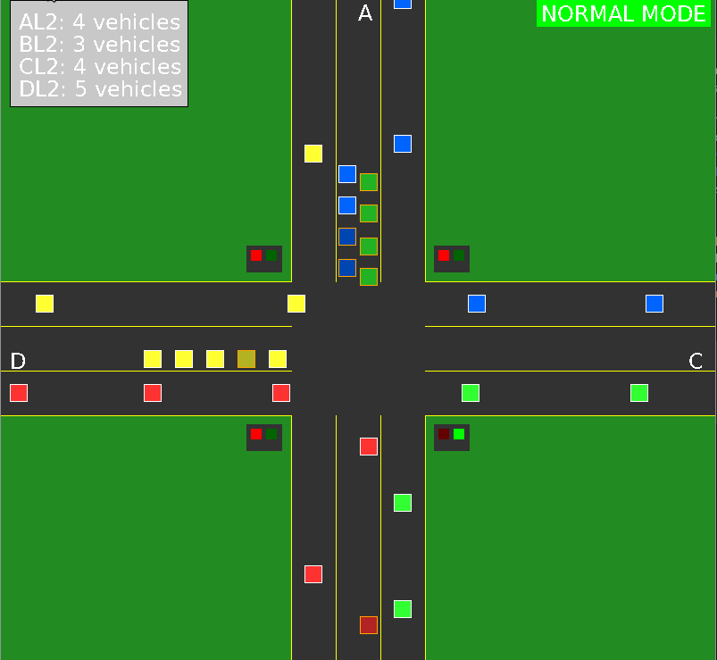
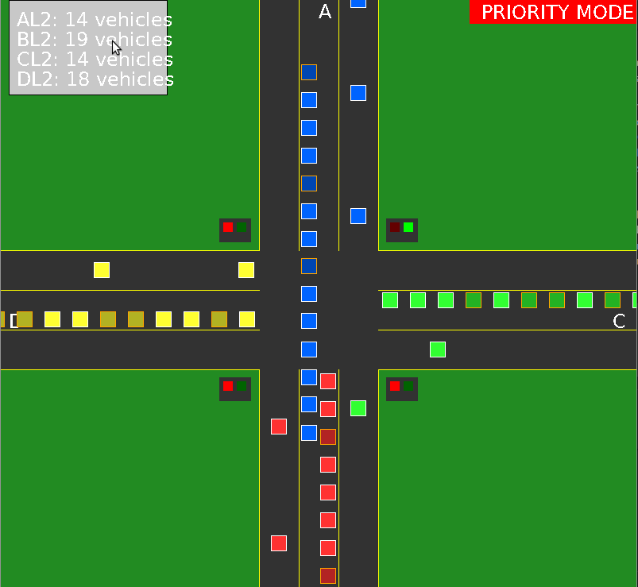

# DSA Queue Simulator - Traffic Intersection Simulation

## Title
**Assignment:** Data Structures and Algorithms - Queue-Based Traffic Simulator  
**Name:** Aadit Chhetri  
**Roll Number:** 17

---

## Summary of Work

This project implements a real-time traffic intersection simulation using the **Queue** data structure in C. The simulation models a four-way intersection with 12 lanes (3 per road: L1, L2, L3), traffic lights, and adaptive traffic management using priority-based and average-based scheduling algorithms.

### Key Accomplishments:
- Implemented a linked-list based Queue data structure for vehicle management
- Built a visual simulation using SDL2 and SDL2_TTF libraries
- Created smooth vehicle animation in the intersection
- Implemented priority mode for lane A when vehicle count exceeds threshold
- Added visual-only vehicles for L1 and L3 lanes showing turning behavior
- Vehicles can go straight or turn right

---

## Data Structure

| Data Structure | Implementation | Purpose |
|----------------|----------------|---------|
| **Queue** | Singly Linked List with front/rear pointers | Manages vehicles waiting at each lane (AL2, BL2, CL2, DL2). FIFO ordering ensures fair vehicle processing. |
| **VehicleNode** | Struct with position, target, state flags | Represents individual vehicles with properties: position (x,y), target position, movement state, turn direction |
| **VisualVehicle** | Struct array (static allocation) | Lightweight structure for visual-only vehicles in L1/L3 lanes |
| **QueueData** | Struct containing 4 Queue pointers | Centralized container for all lane queues and traffic state |
| **SharedData** | Struct with mutex | Thread-safe shared state between main loop and traffic control thread |

### Queue Structure:
```c
typedef struct VehicleNode {
    char vehicleNumber[10];
    char road;// 'A', 'B', 'C', 'D'
    float x, y;// Current position
    float targetX, targetY;// Target position
    bool isMoving, hasCrossed;
    bool isTurning, hasCompletedTurn;
    TurnDirection turnDirection;// TURN_STRAIGHT or TURN_RIGHT
    struct VehicleNode *next;
} VehicleNode;

typedef struct Queue {
    VehicleNode *front;
    VehicleNode *rear;
    int size;
} Queue;
```

---

## List of Functions Using Data Structure

### Queue Operations
| Function | Description |
|----------|-------------|
| `initQueue(Queue *queue)` | Initialize queue with NULL front/rear and size 0 |
| `enqueue(Queue *queue, const char *vehicleNumber, char road)` | Add vehicle to rear of queue, set spawn position |
| `dequeue(Queue *queue)` | Remove and return vehicle from front of queue |
| `getQueueSize(Queue *queue)` | Return current queue size |
| `freeQueue(Queue *queue)` | Free all nodes in queue |
| `getWaitingVehicleCount(Queue *queue)` | Count vehicles that haven't crossed intersection |
| `findLastNonCrossedVehicle(Queue *queue)` | Find last waiting vehicle for spawn positioning |
| `findVehicleAhead(Queue *queue, VehicleNode *current)` | Find vehicle ahead for collision detection |
| `updateQueueTargets(Queue *queue)` | Update target positions after vehicle crosses |

### Vehicle Movement & Traffic Control
| Function | Description |
|----------|-------------|
| `updateVehicles(QueueData *queueData, float deltaTime)` | Main vehicle update loop - movement, collision, crossing |
| `checkQueue(void *arg)` | Traffic light control thread - priority/normal mode logic |
| `isAnyVehicleCrossingIntersection(QueueData *queueData)` | Check if intersection is clear before light change |
| `canMoveForward(VehicleNode *current, VehicleNode *ahead, char road)` | Collision detection between vehicles |

---

## Algorithm Used for Processing Traffic

### 1. Traffic Light Scheduling Algorithm

```
ALGORITHM: Adaptive Traffic Light Control

INPUT: Queue sizes for lanes A, B, C, D
OUTPUT: Green light duration and lane selection

1. Wait for intersection to clear (no vehicles crossing)
2. Get waiting vehicle count for all lanes
3. CHECK PRIORITY MODE:
   - IF sizeA > 10: Activate PRIORITY MODE
   - IF sizeA < 5 AND in priority mode: Deactivate PRIORITY MODE
   
4. DETERMINE LANE TO SERVE:
   IF priority_mode:
       serve = A, vehicles = all waiting in A
   ELSE IF sizeA > 5 AND current_lane != A:
       serve = A (immediate service)
       vehicles = min(sizeA, average)
   ELSE:
       serve = current_lane (rotation: A→B→C→D→A)
       vehicles = min(lane_size, average)
       current_lane = (current_lane + 1) % 4
       
5. Calculate green_time = vehicles × TIME_PER_VEHICLE
6. Set green light for selected lane
7. Wait(green_time)
8. Set red light, GOTO step 1
```

### 2. Vehicle Movement Algorithm

```
ALGORITHM: Vehicle Update per Frame

FOR each queue (A, B, C, D):
    FOR each vehicle in queue:
        IF vehicle has crossed intersection:
            Move towards exit target
            IF turning AND reached turn point:
                Set exit target based on turn direction
            IF off-screen:
                Dequeue and free vehicle
                
        ELSE IF green light for this lane:
            IF vehicle in intersection:
                Mark as crossed
                Set target (straight exit OR turn point)
                Update queue positions
            ELSE:
                IF no collision with vehicle ahead:
                    Move towards intersection
                    
        ELSE (red light):
            Calculate stop position based on queue position
            IF no collision ahead:
                Move towards stop position
```

### 3. Average Calculation for Normal Mode

```
average = ceil((sizeA + sizeB + sizeC + sizeD) / 4)
vehicles_to_serve = min(current_lane_size, average)
```

---

### Overall Complexity
- **Per Frame:** O(n²) where n = total vehicles in all queues
- **Space Complexity:** O(n) for queue storage + O(m) for visual vehicles

## How to Run

### Prerequisites
```bash
# Ubuntu/Debian
sudo apt-get install libsdl2-dev libsdl2-ttf-dev

# Fedora
sudo dnf install SDL2-devel SDL2_ttf-devel

# macOS
brew install sdl2 sdl2_ttf
```

### Build and Run

1. **Clone the repository:**
```bash
git clone https://github.com/dominantitan/dsa-queue-simulator.git
cd dsa-queue-simulator
```

2. **Compile the simulator:**
```bash
gcc simulator/simulator.c -o simulator -lSDL2 -lSDL2_ttf -lpthread -lm
```

3. **Compile the traffic generator:**
```bash
gcc traffic_gen/traffic_generator.c -o traffic_gen -lm
```

4. **Run the traffic generator (Terminal 1):**
```bash
./traffic_gen
```

5. **Run the simulator (Terminal 2):**
```bash
./simulator
```

## Demo

<!-- Add your GIF/video here -->





*The simulation shows vehicles spawning from all four directions, waiting at red lights, and crossing when green. Visual vehicles in L1/L3 lanes demonstrate turning behavior.*

---

## Source Code

- **Repository:** [https://github.com/dominantitan/dsa-queue-simulator](https://github.com/dominantitan/dsa-queue-simulator)
- **Main Simulator:** `simulator/simulator.c`
- **Traffic Generator:** `traffic_gen/traffic_generator.c`

---

## References

1. **SDL2 Documentation:** [https://wiki.libsdl.org/](https://wiki.libsdl.org/)
2. **SDL2_TTF Documentation:** [https://wiki.libsdl.org/SDL2_ttf](https://wiki.libsdl.org/SDL2_ttf)
3. **Queue Data Structure:** Introduction to Algorithms (CLRS), Chapter 10.1
4. **POSIX Threads:** [https://man7.org/linux/man-pages/man7/pthreads.7.html](https://man7.org/linux/man-pages/man7/pthreads.7.html)
5. **Traffic Light Scheduling Algorithms:** Research on adaptive traffic control systems
6. **Delta Time Game Loop:** [https://gafferongames.com/post/fix_your_timestep/](https://gafferongames.com/post/fix_your_timestep/)

---
